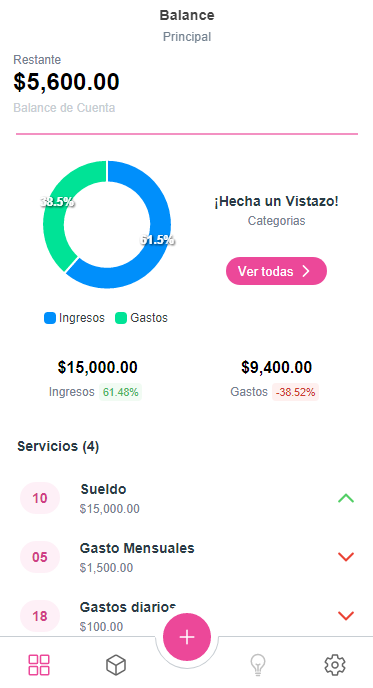
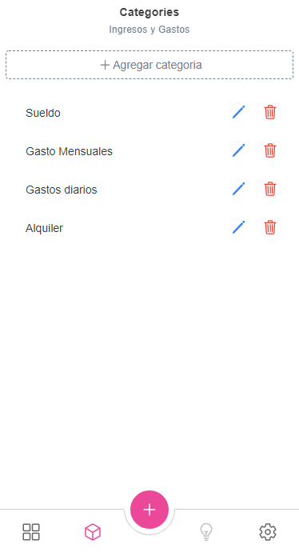
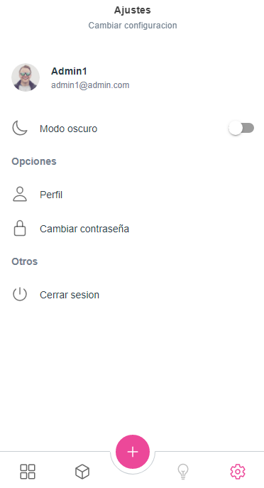

# Sistema de control de gastos





## Made with angular and ionic
---

### Environment
Copy or change backend url api here

#### Default Api url:
> http://localhost:5000/api

```typescript
// environment.ts
export const environment = {
    // Note: without slash at the end.
    api: 'http://localhost:5000/api' // dotnet cli
}
```